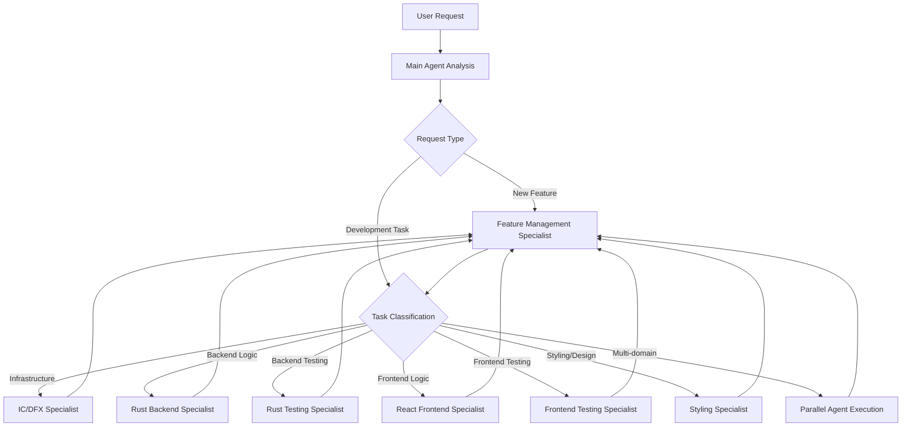

# Agent Workflow Documentation

## Overview
This document defines the specialized agent ecosystem for the ic-ckTestBTC project, establishing clear responsibilities, collaboration patterns, and escalation procedures for optimal development efficiency.

## Agent Ecosystem

### 1. IC/DFX Specialist (`ic-dfx-specialist.md`)
**Primary Role**: Internet Computer infrastructure and deployment management
- DFX replica management and canister deployment
- ckTestBTC integration and Bitcoin testnet operations
- Network configuration and IC-specific troubleshooting
- Candid interface generation and validation

### 2. Rust Backend Specialist (`rust-backend-specialist.md`)
**Primary Role**: Modular IC canister development and Bitcoin integration
- **Anti-Monolith Focus**: Small, focused, reusable Rust modules
- Composable ckTestBTC integration patterns and utilities
- Modular Candid interface design with single-responsibility functions
- Performance optimization through function decomposition

### 3. Rust Testing Specialist (`rust-testing-specialist.md`)
**Primary Role**: Modular backend testing and quality assurance
- **Component-Focused Testing**: Test small, single-purpose functions
- Reusable test utilities and composable test scenarios
- Property-based testing for modular components
- Performance validation of modular function composition

### 4. React Frontend Specialist (`react-frontend-specialist.md`)
**Primary Role**: Functional React/TypeScript frontend development
- **Pure Functional Architecture**: No classes, only functional components and hooks
- **Anti-Monolith Components**: Small, focused, composable React components
- Reusable custom hooks and service patterns
- Type-safe modular development with comprehensive component reuse

### 5. Frontend Testing Specialist (`frontend-testing-specialist.md`)
**Primary Role**: Modular frontend testing and validation
- **Component-Level Testing**: Test small, focused components individually
- Reusable test utilities and composable test patterns
- Functional service layer mocking (no classes)
- Accessibility and performance testing for component library

### 6. Styling & Component Design Specialist (`styling-component-specialist.md`)
**Primary Role**: Modular visual design and reusable component styling
- **Anti-Monolith Styling**: Small, focused, composable styled components
- Reusable design patterns with Tailwind CSS and shadcn/ui
- Style utility composition and component library development
- Performance optimization through style reuse and modular design

### 7. Feature Management Specialist (`feature-management-specialist.md`)
**Primary Role**: Feature tracking and comprehensive project progress management
- **FEATURES.md Management**: Maintain comprehensive feature tracking system
- **Requirements Analysis**: Break down user requests into actionable development tasks
- **Progress Monitoring**: Track implementation status across all specialists
- **Quality Assurance**: Ensure feature completeness and acceptance criteria validation

## Workflow Patterns

### Task Initiation Flow

### Collaboration Patterns

#### Backend Development Flow
1. **Main Agent** receives backend task
2. **Rust Backend Specialist** implements core logic
3. **IC/DFX Specialist** handles deployment and infrastructure
4. **Rust Testing Specialist** validates implementation
5. **Main Agent** coordinates integration and reporting

#### Frontend Development Flow
1. **Main Agent** receives frontend task
2. **Feature Management Specialist** documents requirements and creates tracking entry
3. **React Frontend Specialist** implements component logic
4. **Styling Specialist** applies design and styling
5. **Frontend Testing Specialist** validates implementation
6. **Feature Management Specialist** validates completion and updates FEATURES.md
7. **Main Agent** coordinates integration and reporting

#### Full-Stack Feature Flow
1. **Main Agent** analyzes cross-cutting feature requirements
2. **Feature Management Specialist** creates comprehensive feature documentation and tracking
3. **Parallel Execution**:
   - **Rust Backend Specialist** + **IC/DFX Specialist** (backend)
   - **React Frontend Specialist** + **Styling Specialist** (frontend)
4. **Testing Phase**:
   - **Rust Testing Specialist** (backend validation)
   - **Frontend Testing Specialist** (frontend validation)
5. **Feature Management Specialist** validates completion against acceptance criteria
6. **Main Agent** coordinates integration testing and deployment

## Escalation Procedures

### When to Escalate to Main Agent
- **Architectural Decisions**: Changes affecting multiple layers
- **Cross-Domain Issues**: Problems spanning backend and frontend
- **Project Planning**: Feature roadmap and milestone planning
- **External Dependencies**: Third-party integration decisions
- **Security Concerns**: Cross-cutting security implications
- **Feature Conflicts**: Competing requirements or resource conflicts
- **Milestone Blockers**: Issues preventing feature completion

### When to Collaborate Between Specialists
- **Type Definitions**: Backend and Frontend specialists coordinate on interfaces
- **Performance Issues**: Backend and Frontend testing specialists collaborate
- **Design Implementation**: Frontend and Styling specialists work together
- **Infrastructure Changes**: IC/DFX specialist coordinates with all development specialists
- **Feature Planning**: Feature Management specialist coordinates with all development specialists
- **Progress Tracking**: All specialists report status to Feature Management specialist
- **Requirements Clarification**: Feature Management specialist works with requesting specialists

## Quality Gates

### Anti-Monolith Quality Standards
**All specialists must enforce:**
- **Component Size Limits**: Functions <50 lines, Components <100 lines
- **Single Responsibility**: Each component/function serves ONE purpose
- **Reuse Validation**: Check existing codebase before creating new components
- **Composition Verification**: Complex features built from simple, reusable parts
- **Functional Patterns**: No classes in frontend code, functional composition throughout

### Backend Quality Gates
1. **Rust Backend Specialist** implements modular, reusable features
2. **IC/DFX Specialist** validates modular deployment compatibility
3. **Rust Testing Specialist** ensures comprehensive test coverage for all modules
4. **Main Agent** approves modular architecture and component integration

### Frontend Quality Gates
1. **React Frontend Specialist** implements functional, composable component logic
2. **Styling Specialist** applies reusable, modular design patterns
3. **Frontend Testing Specialist** validates modular functionality and component composition
4. **Main Agent** approves functional architecture and component reuse

### Integration Quality Gates
1. **All specialists** complete modular, reusable domain-specific components
2. **Testing specialists** run integration tests validating component composition
3. **Feature Management Specialist** validates features against acceptance criteria
4. **IC/DFX Specialist** validates deployment of modular architecture
5. **Feature Management Specialist** updates FEATURES.md with completion status
6. **Main Agent** conducts final validation of overall system modularity

## Communication Protocols

### Task Handoffs
- **Clear Context**: Each specialist receives comprehensive task context
- **Dependency Mapping**: Clear identification of dependencies and prerequisites
- **Expected Deliverables**: Specific output expectations and quality criteria
- **Timeline Coordination**: Realistic estimation and scheduling

### Status Reporting
- **Progress Updates**: Regular updates to Main Agent on task progress
- **Blockers and Issues**: Immediate escalation of blocking issues
- **Quality Metrics**: Reporting of test coverage, performance metrics, etc.
- **Completion Confirmation**: Clear notification when tasks are complete

### Knowledge Sharing
- **Best Practices**: Specialists share domain-specific best practices
- **Lessons Learned**: Documentation of solutions to common problems
- **Tool Updates**: Notification of new tools or improved workflows
- **Architecture Evolution**: Collaborative input on architectural improvements

## Performance Optimization

### Parallel Execution Guidelines
- **Independent Tasks**: Execute specialists simultaneously when tasks don't conflict
- **Resource Management**: Balance concurrent agent execution to avoid resource contention
- **Coordination Points**: Define clear sync points for dependent tasks
- **Rollback Procedures**: Clear procedures if parallel execution conflicts occur

### Efficiency Measures Through Modularity
- **Component Reuse**: Leverage existing modular components for faster development
- **Function Composition**: Build complex features from proven, reusable functions
- **Pattern Recognition**: Identify and reuse established architectural patterns
- **Modular Testing**: Test individual components independently for faster validation
- **Incremental Development**: Build features compositionally from small, working parts

### Anti-Monolith Performance Benefits
- **Faster Development**: Reusing existing components reduces implementation time
- **Easier Debugging**: Small, focused components are easier to isolate and fix
- **Better Testing**: Modular components can be tested independently
- **Improved Maintainability**: Changes to small components have limited scope
- **Enhanced Collaboration**: Multiple specialists can work on different modules simultaneously

## Success Metrics

### Development Velocity
- **Time to Feature**: Measure end-to-end feature development time
- **Bug Resolution**: Track time to resolve domain-specific issues
- **Quality Gates**: Measure pass rate of quality gates on first attempt

### Code Quality Through Modularity
- **Test Coverage**: Backend >80%, Frontend >85% coverage targets for all modules
- **Component Reuse**: Measure percentage of new features built from existing components
- **Function Size**: Enforce <50 line functions, <100 line components
- **Dependency Analysis**: Track and minimize coupling between modules
- **Pattern Consistency**: Validate consistent use of established patterns
- **Performance**: Optimize through efficient component composition
- **Security**: Validate security through composable, tested security patterns
- **Maintainability**: Measure ease of change through modular architecture metrics

### Team Coordination
- **Handoff Efficiency**: Smooth task transitions between specialists
- **Escalation Rate**: Appropriate use of escalation procedures
- **Knowledge Transfer**: Effective sharing of domain expertise
- **Issue Resolution**: Collaborative problem-solving effectiveness